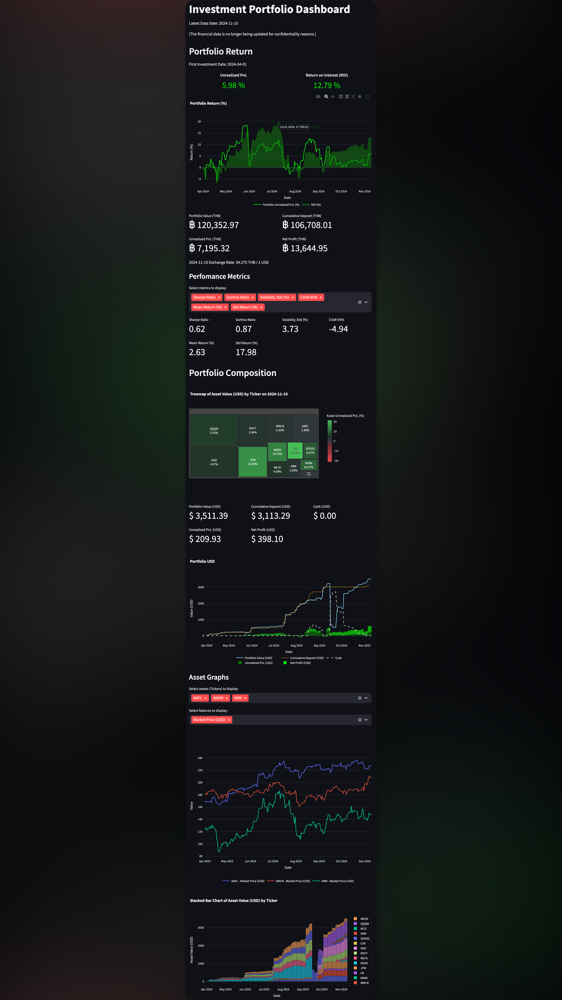
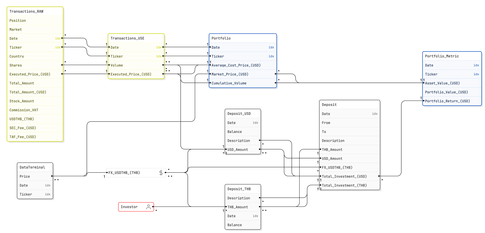
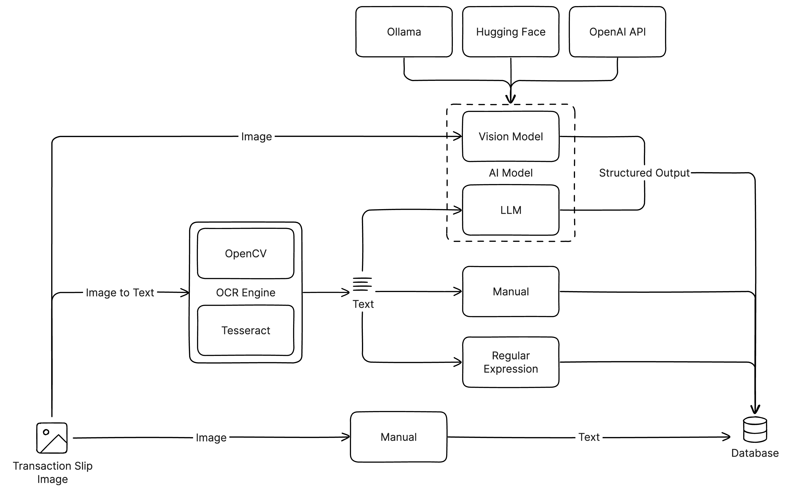
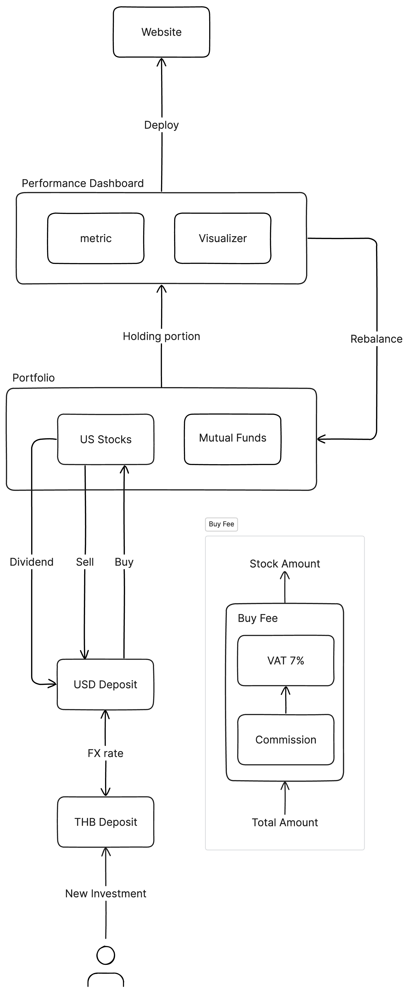
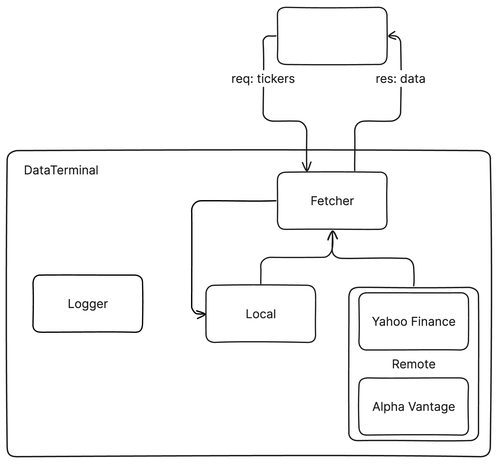

# Investment Portfolio Analytics Dashboard Web App

## Overview
Investment-Portfolio is a Python-based project designed to track and analyze investment transactions from various sources e.g. Dime US Stocks, Dime Mutual Funds. The extracted data is then processed, analyzed, and visualized to provide valuable insights into your investment portfolio.

### Features

- **OCR Processing** (in-progress): Extracts data from transaction slips using OCR.
- **Data Integration**: Combines data from different investment sources into a unified format.
- **Data Analysis**: Analyzes transaction data to provide insights and performance metrics.
- **Visualization**: Visualizes portfolio performance and transaction history using various charts and graphs.

## System Design

### ER Diagram

### TransactionSlip-to-Database

### Flow Diagram
(partially)

### DataTerminal
For download market data.

